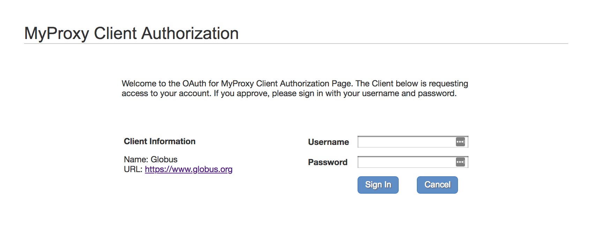

[CADES](http://support.cades.ornl.gov/) &rarr; [User Documentation](../README.md) &rarr; [Globus Overview](globus-overview.md) &rarr; [Globus Endpoints](globus-endpoints.md)

# Globus Endpoints

Globus Endpoints are storage systems to which you have access. Once an Endpoint is located or created Globus saves the location for you so you do not need to repeatedly search type paths.

| Endpoint Search Term(s)   | Storage System  |  Path  | Description  |
| ------------------------- | --------------- | ------ | ------------ |
| CADES OR  | NFS  | /~/    | CADES open research, user home directory |
| CADES OR  | NFS  | /data/ | CADES open research, NFS project directories |
| CADES OR  | Lustre  | /lustre/or-hydra/  | CADES open research, project directories. High-performance, temporary storage. |
| NCCS Open DTN| Lustre | See [here](https://www.olcf.ornl.gov/for-users/system-user-guides/titan/file-systems/#data-management-policy-summary) | Requires NCCS Open (XCAMS) account |
| OLCF ATLAS  | OLCF DTN  | /path/to/project/file/data   | OLCF-managed NFS and Lustre storage system. |

&#128221; **Note:** If you're having trouble finding an existing Endpoint, [email the CADES team](mailto:cades-help@ornl.gov).

## Setting Up Endpoints

> Note: AWS S3 Scality storage is not yet supported on Globus, but will be in the future.   

1. Click in the Endpoint box on the left side and search for `CADES-OR` (CADES Open Research).
-  You will be redirected to enter your UCAMS credentials.   
       
    <!-- o_ -->      
    * Authenticating the Endpoint with your credentials is known as *Endpoint Activation* and can be done when adding and using an Endpoint for the first time, or can be completed by navigating to the "Manage Endpoints" screen as shown in the following image (`Endpoints`&rarr;`Endpoint List`&rarr;`activate`).   
       
    <!-- o_ -->    
-  Once the endpoint is set you can modify the path to point to your file/data. In this example, we will connect to Lustre storage: `lustre/or-hydra/cades-ops/proj-shared`
-  On the right side, set the endpoint. We will use OLCF Titan's file system. Search for `OLCF ATLAS`.
-  Again, you may adjust the path. Your home directory is default.

## Creating an Endpoint on your Personal or Work Computer
It is easy to use your personal or work computer as a Globus Endpoint. Follow the instructions below.

&#128221; **Note:** You may need to [create a firewall exception](https://safer.ornl.gov) for the Globus Personal Client. For configuration instructions, please consult the [details](https://docs.globus.org/how-to/configure-firewall-gcp/) on the Globus site.

1. Choose a descriptive name for your endpoint and click `Generate Setup Key`.
- Copy the Setup Key. You will paste this into the software during setup.
- Navigate to the [Globus Personal Connect webpage](https://www.globus.org/globus-connect-personal) to download the client onto your personal (or ORNL-owned) computer.
-  Click on the name of your operating system to obtain detailed instructions for installing the client and setting up the Endpoint.   
       
    <!-- o_ -->
- Once the client is installed, launch the program. You will be prompted to paste your setup key.
    &#128221; **Note:** The Globus Personal Endpoint Client may produce errors if you are connected to the ORNL network via VPN.
- Now you may use the Globus web interface or the [command line interface](globus-command-line-interface.md) to search for your new endpoint using the name you provided in step 1.
