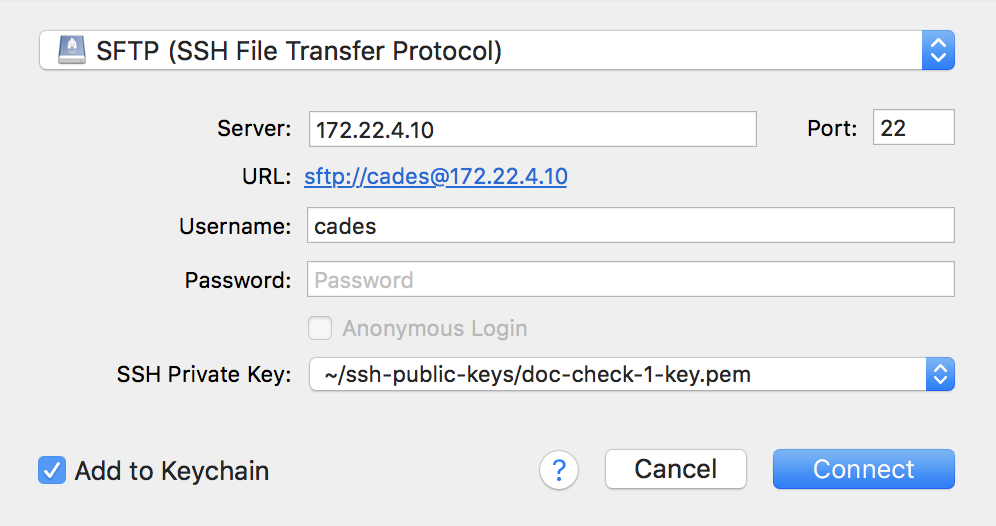
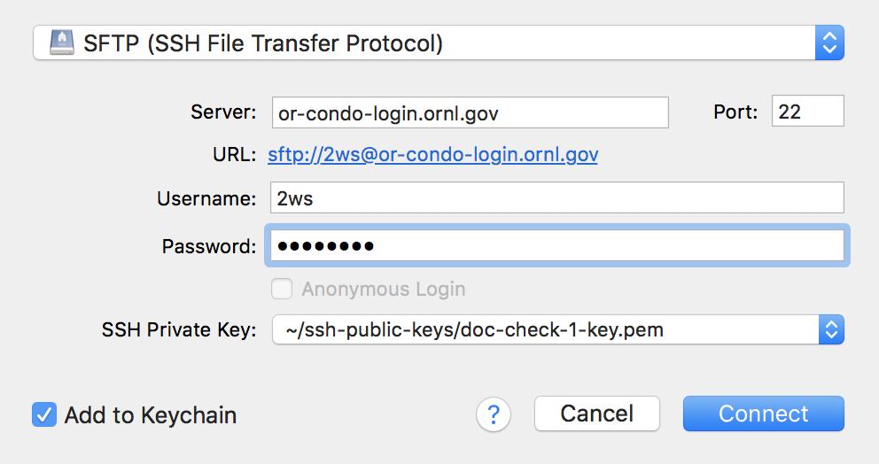
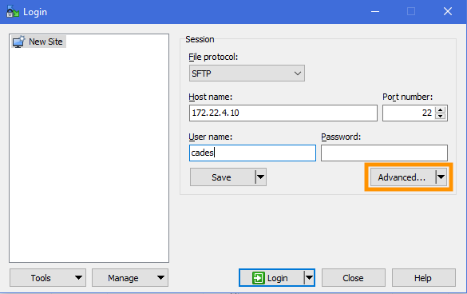
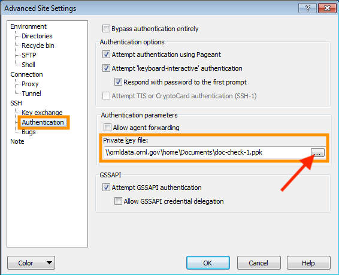
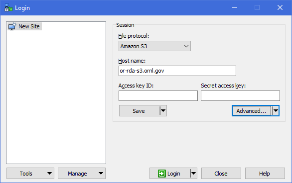
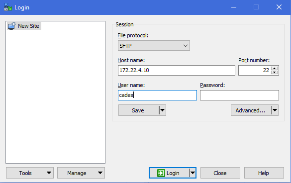

# Transferring Files (SFTP) with a Graphical Client

Graphical file transfer clients can be used to move data between your local machine and remote storage locations. Once you install the client on your computer and set up the remote connection, you may move folders and files between your computer and the remote storage using a drag-and-drop method.

&#128221; **Note:** It is impractical to maintain documentation on every storage system that CCLA offers. These examples are chosen to be representative of our services. If you need help connecting to a different storage service, please [contact the CCLA](../SUPPORT.md).

## CyberDuck (macOS and Windows)
Download Cyberduck [here](https://cyberduck.io/) and run the installation.

_**AWS S3 - Scality**_
-  To set up a new connection, click on the `Open Connection` button in the top left of the window.
-  In the dropdown menu of the resulting window, select `Amazon S3`.
-  For Scality, change the server field to `tigris-s3.doane.edu`.
-  Paste your Access Key ID and Secret Access Key that was generated when you signed up for the AWS S3 service.
-  Click `Connect`.   
       
    <!-- o_ -->  
<!-- TODO @pae will refresh ldap groups to refresh AWS keys -->

_**OpenStack Virtual Machine**_
-  To set up a new connection, click on the `Open Connection` button in the top left of the window.
-  In the dropdown menu of the resulting window, select `SFTP (SSH File Transfer Protocol)`.
-  Server: the IP address of your virtual machine
-  Username: `username`
-  Password: leave blank
-  Select your SSH key from the dropdown menu. Be sure to choose the SSH key that allows you to access your OpenStack virtual machine.   
-  Click `Connect`.   
       
    <!-- o_ -->  

_**CCLA OR Condo SHPC, NFS, and Lustre**_
-  To set up a new connection, click on the `Open Connection` button in the top left of the window.
-  In the dropdown menu of the resulting window, select `SFTP (SSH File Transfer Protocol)`.
-  Server: `tigris.doane.edu`
-  Username: your UCAMS ID (UID)
-  Password: your UCAMS password
-  Select your SSH key from the dropdown menu. Be sure to choose the SSH key that allows you to access the CCLA OR SHPC Condo login node.
-  Click `Connect`.  
    > NFS user home directory path: `~/home/UID/`   
    > Lustre storage path: `~/lustre/tigris/`    

       
    <!-- o_ -->

## WinSCP (Windows)
Download WinSCP [here](https://winscp.net/eng/download.php) and run the installation.   
&#128221; **Note:** In cases where an SSH key is required for access, you must store the path to the key in WinSCP for each connection. To store the key, enter the connection information that you will find in the steps below. Then, click the `Advanced...` button. Provide the path to your SSH private key.   
   
<!-- o_ -->  
   
<!-- o_ -->  

_**AWS S3 - Scality**_
-  To set up a new connection, click on `New Site` in the top left of the window.
-  In the `File protocol` dropdown menu on the right, select `Amazon S3`.
-  Host name: `tigris-s3.doane.edu`
-  Paste your Access Key ID and Secret Access Key that was generated when you signed up for the AWS S3 service.
-  Click `Login`.   
       
    <!-- o_ -->  

_**OpenStack Virtual Machine**_
-  To set up a new connection, click on `New Site` in the top left of the window.
-  In the `File protocol` dropdown menu  on the right, select `SFTP`.
-  Host name: the IP address of your virtual machine
-  User name: `username`
-  Password: leave blank
-  Click `Login`.  
       
    <!-- o_ -->  

_**CCLA HPC, NFS, and Lustre**_
-  To set up a new connection, click on `New Site` in the top left of the window.
-  In the `File protocol` dropdown menu  on the right, select `SFTP`.
-  Host name: the IP address of your virtual machine
-  Username: your UCAMS ID (UID)
-  Password: your UCAMS password
-  Click `Login`.  
    > NFS user home directory path: `~/home/UID/`   
    > Lustre storage path: `~/lustre/tigris/`    

       
    <!-- o_ -->  

## Related Tutorials
* [Scality Object Storage User Guide](data-transfer-storage/scality-guide.md)
* [Globus Data Transfer Tool](data-transfer-storage/globus-overview.md)
* [Access VM Instances](../openstack/access-vm/access-vm.md)
