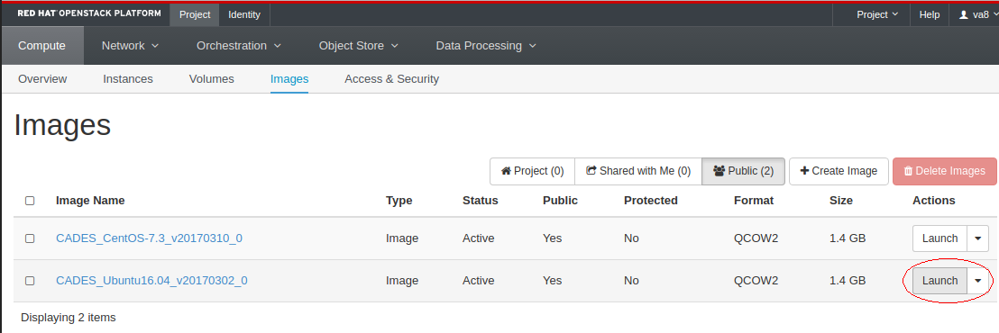
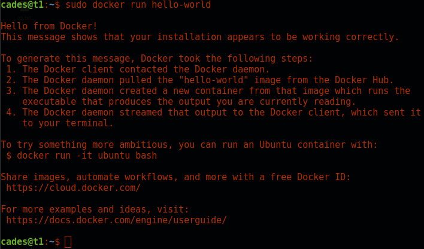

# Docker Containers

## Background

[Docker](https://www.docker.com/) is a [container](https://en.wikipedia.org/wiki/Operating-system-level_virtualization) architecture and ecosystem.  A [linux.com article](https://www.linux.com/news/docker-shipping-container-linux-code) nicely summarizes Docker as follows:

>Docker is a tool that can package an application and its dependencies in a virtual container that can run on any Linux server. This helps enable flexibility and portability on where the application can run, whether on premises, public cloud, private cloud, bare metal, etc.

Containers have somewhat similar goals to a virtual machine (vm).  However, a Docker container is not a vm.  You are probably aware that vm's have some performance overhead compared to running things natively.  However, it is worth noting that the applications that run inside of Docker containers actually run *natively*. Your Docker containers share the kernel with their host operating system. So there is no double overhead in running a container inside our vm.  However, we still suffer some performance penalty by having virtualized in the first place.

Many of the applications you will be interested in deploying are already configured for very easy use with Docker.  You can find public repositories of many of your favorite applications set up on [Docker Hub](https://hub.docker.com/).


## First Steps

We will assume that you are already reasonably familiar with the CCLA Cloud system.  If not, consider reading the [user documentation](http://support.cades.ornl.gov/user-documentation/_book/).  Make sure you read the section titled: [Launch a VM Instance from an Image](http://support.cades.ornl.gov/user-documentation/_book/openstack/create-vm/launch-vm.html)

However, you get there, launch an Ubuntu 16.04 vm.



For now, you can keep the setup very basic, just following the instructions outlined in the "Launch a VM Instance" page linked above.

You may eventually be interested in more complicated configurations.  For example, you may need to modify the security group details (say, for example, you want to run a docker container that runs a web server).  For now, we will ignore those details.  However, we provide a more complicated example in our Shiny tutorial.


## Install Docker

Next, you need to [ssh to your new vm](../../access-vm/access-vm.md).  I named my instance `t1`, so when I login, it shows me as `cades@t1`.  Your prompt will show `cades@whatever-you-named-your-vm`.

Having logged in, it's time to install Docker.  The official Docker documentation [provides a lot of useful information](https://docs.docker.com/engine/installation/linux/ubuntu/#install-using-the-repository) to this end.  Below we summarize only the steps outlined in that article.  If you wish to understand an individual step or if something goes wrong, please refer to the article.

Otherwise, run:

```bash
sudo apt-get install \
    apt-transport-https \
    ca-certificates \
    curl \
    software-properties-common

curl -fsSL https://download.docker.com/linux/ubuntu/gpg | sudo apt-key add -

sudo apt-key fingerprint 0EBFCD88

sudo add-apt-repository \
   "deb [arch=amd64] https://download.docker.com/linux/ubuntu \
   $(lsb_release -cs) \
   stable"

sudo apt-get update
sudo apt-get install -y docker docker.io
```

And if all is well, you should have Docker installed on your vm.

## Run a Test Container

While still ssh'd to your CCLA Cloud vm, you can test that your setup is working correctly by running:

```bash
sudo docker pull hello-world
sudo docker run hello-world
```

If all goes well, you will have a small "hello world"-like output and return to your terminal, and should look something like this:



That's it!
