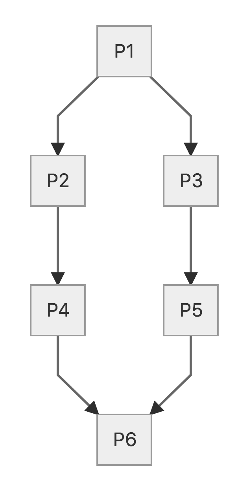

# Crystal Workflow

CrystalFlow is a hypothetical workflow with low-medium complexity that adequately illustrates the benefits and characteristics of scientific computational workflows.
> &#128221; **Note:** The code, executables, and test data for the crystal workflow is available on ORNL's public [GitLab](https://code.ornl.gov/km0/cades_workflows).

#### About the Crystal Workflow
The workflow is a crystal shaped graph as shown in the figure below.

<a target="_new" href="../screenshots/crystal-workflow-mermaid.png"></a>   
<!-- o_ -->

In the above workflow, each of the boxes represent process and arrows represent the dependency between connected processes. For example, process `P1` produces a data file that is consumed by processes `P2` and `P3`.

Each of the 6 processes of this workflow are implemented in C and bash. Either may be used in the workflows shown below. The initial input file is pre-prepared. The code and data for these workflows are available on open HPC condo at `/software/T/B/D`. A `Makefile` will build the C executables found in the directory named `c`. The following sections show how this workflow may be orchestrated using each of the three workflow management tools.

#### Nextflow

The following code snippet shows how the above workflow would be expressed in Nextflow.

```bash
#!/usr/bin/env nextflow

in1  = file('/home/km0/crystalworkflow/shell/inputs/in1.txt')

process p1 {
    input:
    file in1
    output:
    file 'out1.txt' into out1
    """
    ~/crystalworkflow/shell/p1/p1.sh $in1 'out1.txt'
    """
}

process p2 {
    input:
    file out1
    output:
    file 'out2.txt' into out2
    """
    ~/crystalworkflow/shell/p2/p2.sh $out1 'out2.txt'
    """
}

process p3 {
    input:
    file out1
    output:
    file 'out3.txt' into out3
    """
    ~/crystalworkflow/shell/p3/p3.sh $out1 'out3.txt'
    """
}

process p4 {
    input:
    file out2
    output:
    file 'out4.txt' into out4
    """
    ~/crystalworkflow/shell/p4/p4.sh $out2 'out4.txt'
    """
}
process p5 {
    input:
    file out3
    output:
    file 'out5.txt' into out5
    """
    ~/crystalworkflow/shell/p5/p5.sh $out3 'out5.txt'
    """
}
process p6 {
    input:
    file out4
    file out5
    output:
    file 'out6.txt' into out6
    """
    ~/crystalworkflow/shell/p6/p6.sh $out4 $out5 'out6.txt'
    """
}

```

Assuming the above workflow is saved in a file named `crystal.nf`, it could be run as follows:

```bash
$ module purge
$ module load PE-gnu
$ module load java/1.8.0_131
$ module load nextflow
$
$ nextflow run crystal.nf

N E X T F L O W  ~  version 0.27.6
Launching `crystal.nf` [thirsty_allen] - revision: e3b42d107d
[warm up] executor > local
[db/d513da] Submitted process > p1
[89/e16494] Submitted process > p2
[c3/9d4ddd] Submitted process > p3
[0d/5406b9] Submitted process > p4
[cf/4b94bb] Submitted process > p5
[c2/3bae00] Submitted process > p6

```


#### Makeflow

The following code snippet shows how the crystal workflow would be implemented
using Makeflow.

```bash
P1=../shell/p1/p1.sh
P2=../shell/p2/p2.sh
P3=../shell/p3/p3.sh
P4=../shell/p4/p4.sh
P5=../shell/p5/p5.sh
P6=../shell/p6/p6.sh

../shell/p1/out1.txt:
	$P1 ../shell/inputs/in1.txt ../shell/p1/out1.txt
../shell/p2/out2.txt:
	$P2 ../shell/p1/out1.txt ../shell/p2/out2.txt
../shell/p3/out3.txt:
	$P3 ../shell/p1/out1.txt ../shell/p3/out3.txt
../shell/p4/out4.txt:
	$P4 ../shell/p2/out2.txt ../shell/p4/out4.txt
../shell/p5/out5.txt:
	$P5 ../shell/p3/out3.txt ../shell/p5/out5.txt
../shell/outputs/out6.txt:
	$P6 ../shell/p4/out4.txt ../shell/p5/out5.txt ../shell/outputs/out6.txt

```

Assuming the above workflow is saved in a file named `crystal.mkf`, it could be executed like so:

```bash
$ module purge
$ module load PE-gnu
$ module load cctools/6.2.7
$ makeflow crystal.mkf
parsing crystal.mkf...
local resources: 32 cores, 128833 MB memory, 6593404 MB disk
max running local jobs: 32
checking crystal.mkf for consistency...
crystal.mkf has 6 rules.
starting workflow....
submitting job: ../shell/p6/p6.sh ../shell/p4/out4.txt ../shell/p5/out5.txt ../shell/outputs/out6.txt
submitted job 37132
submitting job: ../shell/p5/p5.sh ../shell/p3/out3.txt ../shell/p5/out5.txt
submitted job 37133
submitting job: ../shell/p4/p4.sh ../shell/p2/out2.txt ../shell/p4/out4.txt
submitted job 37134
submitting job: ../shell/p3/p3.sh ../shell/p1/out1.txt ../shell/p3/out3.txt
submitted job 37135
submitting job: ../shell/p2/p2.sh ../shell/p1/out1.txt ../shell/p2/out2.txt
submitted job 37136
submitting job: ../shell/p1/p1.sh ../shell/inputs/in1.txt ../shell/p1/out1.txt
submitted job 37137
cat: ../shell/p3/out3.txt: No such file or directory
p3 completed.
p5 completed.
p4 completed.
job 37135 completed
p1 completed.
p2 completed.
job 37134 completed
job 37133 completed
job 37136 completed
job 37137 completed
p6 completed.
job 37132 completed
nothing left to do.
```

#### Swift

The following code snippet shows the Swift implementation of the crystal workflow. Note that the Swift implementation invokes the C version of executables but it can equally invoke the bash version.

```c
import io;

app (file out) p1 (file inp){ "../c/p1/p1" inp out }

app (file out) p2 (file inp){ "../c/p2/p2" inp out }

app (file out) p3 (file inp){ "../c/p3/p3" inp out }

app (file out) p4 (file inp){ "../c/p4/p4" inp out }

app (file out) p5 (file inp){ "../c/p5/p5" inp out }

app (file out) p6 (file inp1, file inp2){ "../c/p6/p6" inp1 inp2 out }

file in1 = input("../c/inputs/in1.txt");

file out1 <"../c/p1/out1.txt">      = p1(in1);
file out2 <"../c/p2/out2.txt">      = p2(out1);
file out3 <"../c/p3/out3.txt">      = p3(out1);
file out4 <"../c/p4/out4.txt">      = p4(out2);
file out5 <"../c/p5/out5.txt">      = p5(out3);
file out6 <"../c/outputs/out6.txt"> = p6(out4,out5);
```

Assuming the above program is saved in a file called `crystal.swift`, it may be run on Open HPC like so:

```bash
$ module purge
$ module load PE-gnu
$ module load java/1.8.0_131 mpich/3.2
$ module load swift

$ stc crystal.swift

$ turbine -n 2 crystal.tic
../c/p1/out1.txt
../c/p3/out3.txt
../c/p2/out2.txt
../c/p5/out5.txt
../c/p4/out4.txt
../c/outputs/out6.txt
```
<!-- pointless comment -->
