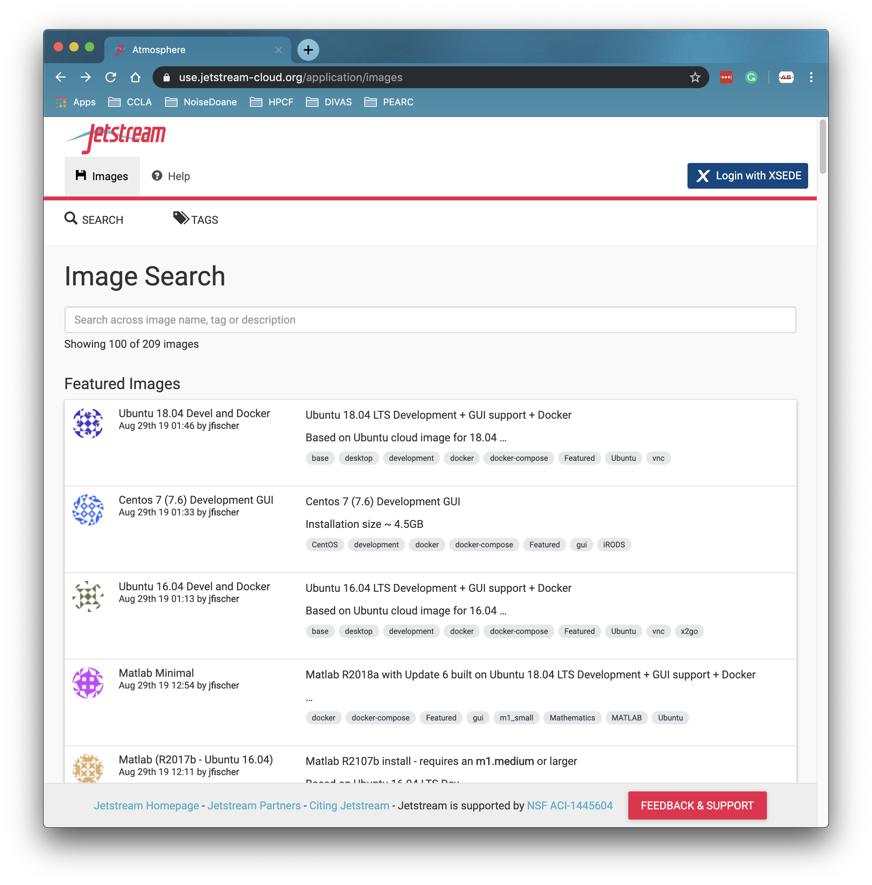
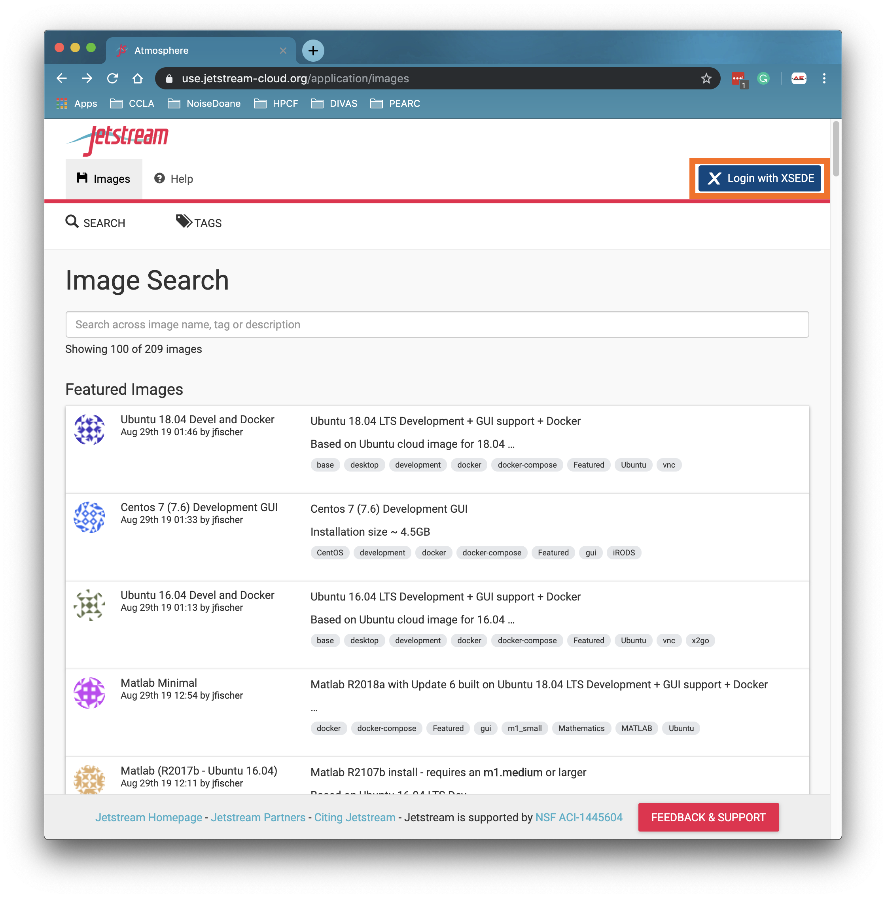
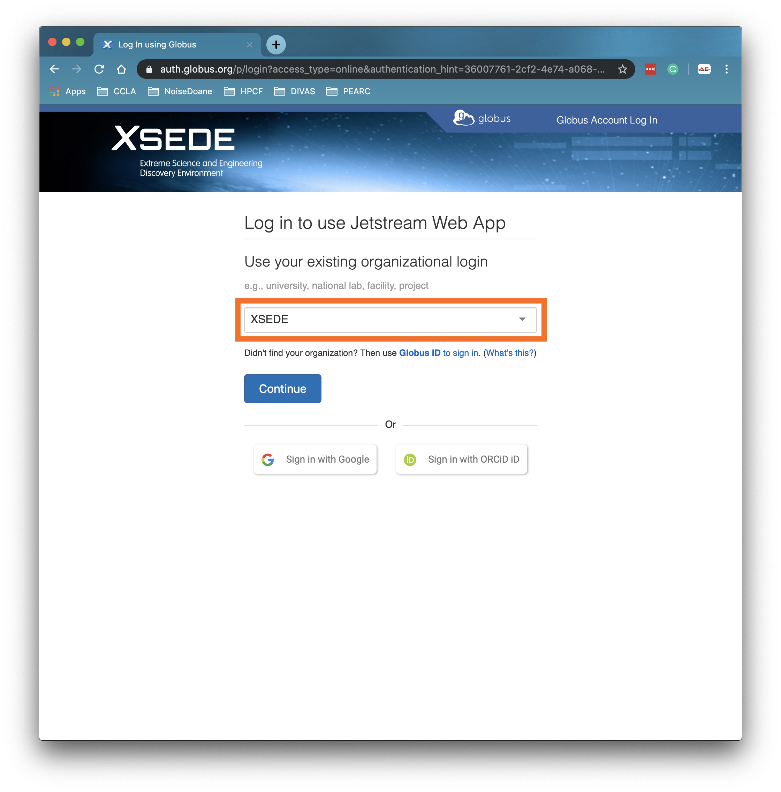
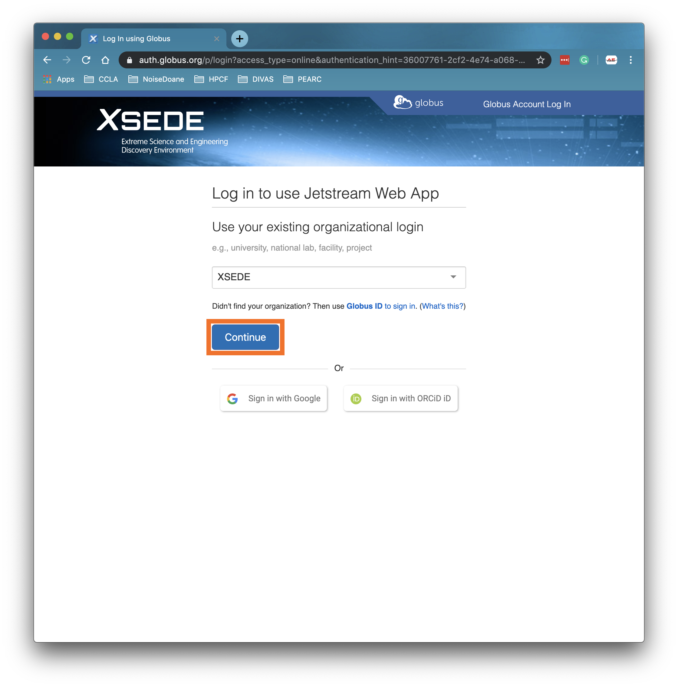
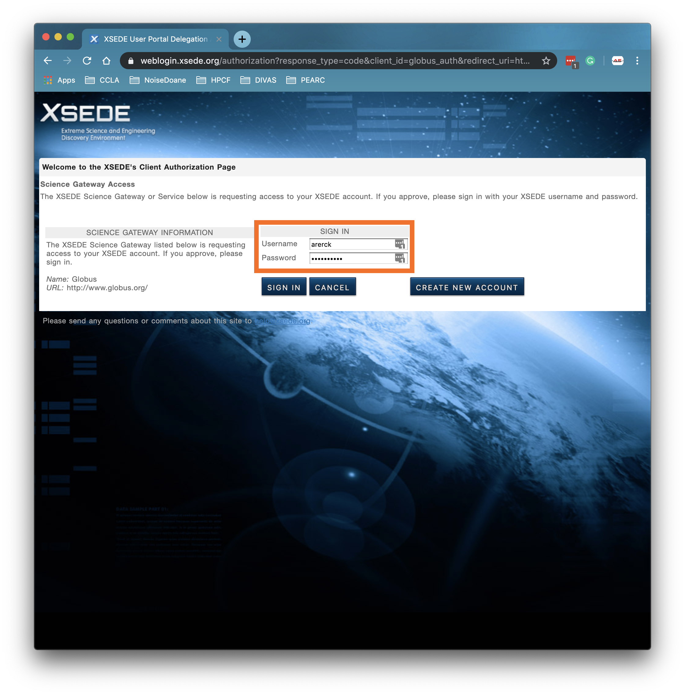
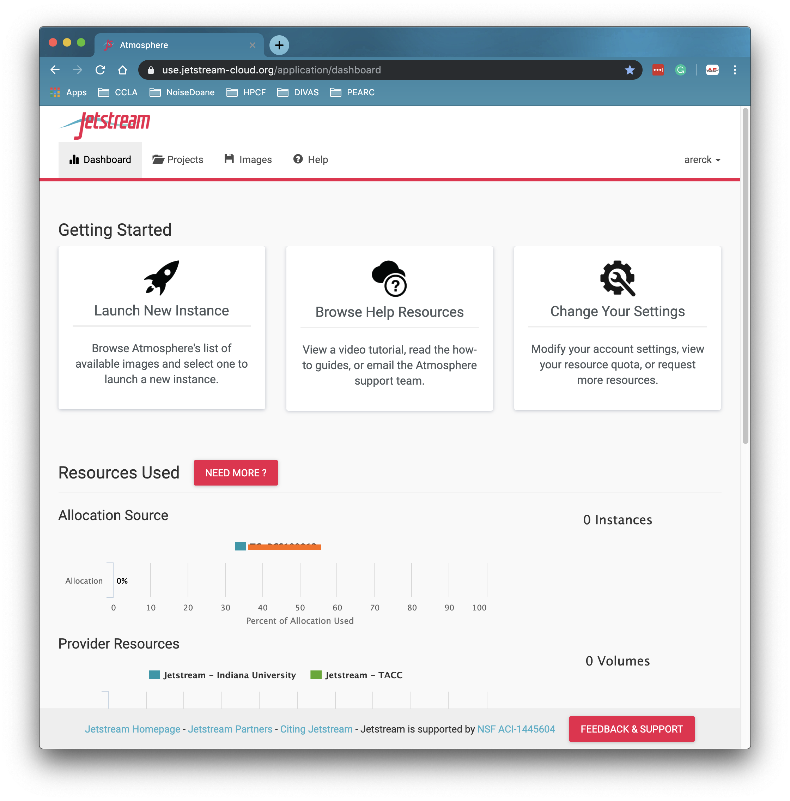
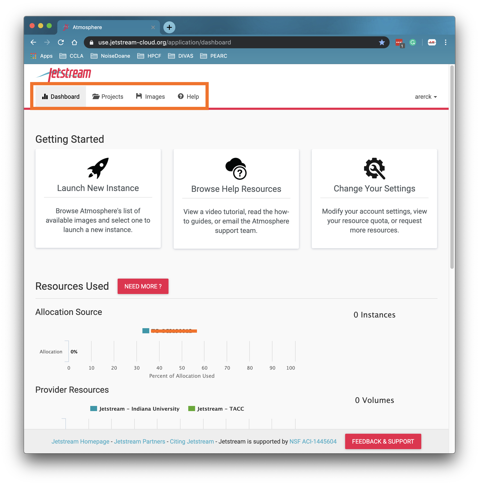
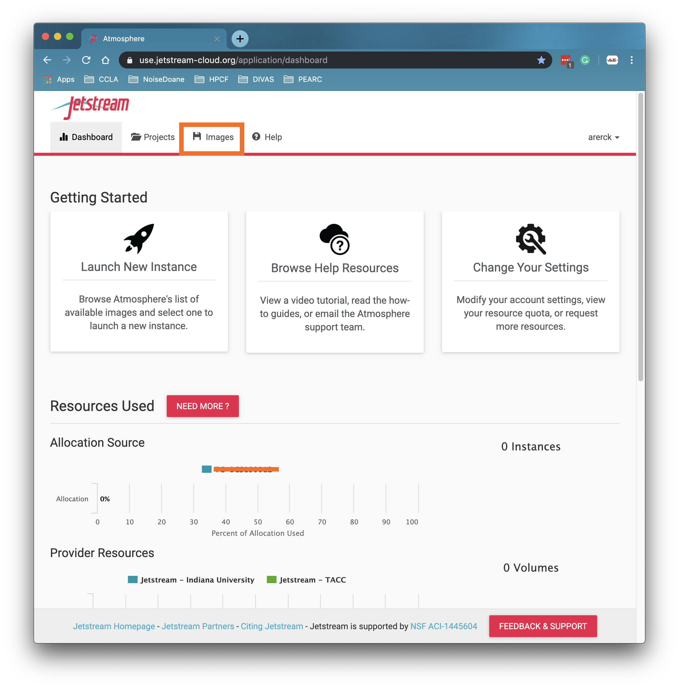
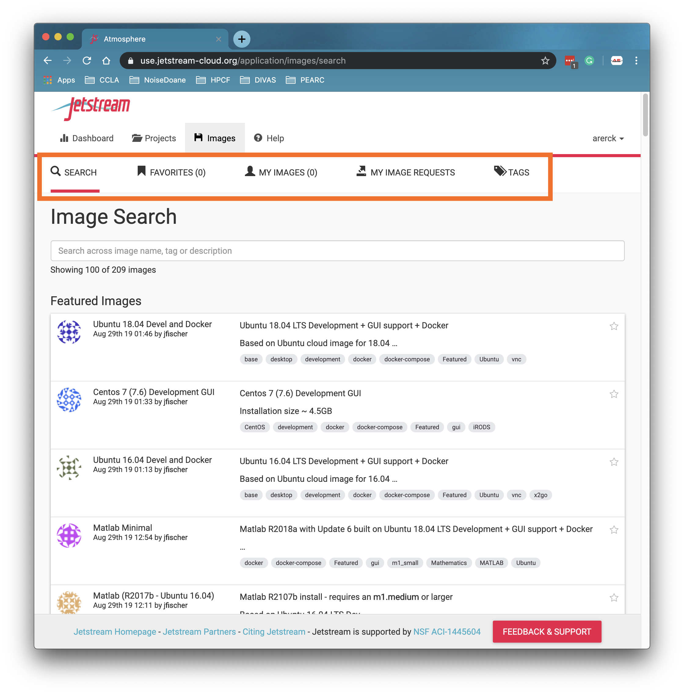

# Accessing Atmosphere
## IU/TACC Jetstream Graphical User Interface

1. Navigate your favorite browser to https://use.jetstream-cloud.org, this is the Jestream Graphical User Interface Atmosphere.   

2. Next, click on the "Login with XSEDE" button highlighted with an orange box in the image below.   
   

3. Once on the XSEDE page, make sure "XSEDE" is listed in the dropdown menu highlighted in the image below.   
   

4. Click on the "Continue" button, again highlighted in orange.   

5. You will be redirected to an XSEDE login page, enter your XSEDE Username and Password here.   

6. Once you have entered your credentials, click "SIGN IN"   

7. You will now be redirected to the Atmosphere Dashboard with information about your allocation and any previous work you might have done with Jetstream.   

8. From the menu highlighted by the orange box in the image below, we can navigate to this dashboard, your projects, a listing of Virtual Machine Images, and the Help page.   

9. We should now select the "Images" button to go look at the list of available Virtual Machine Images.   

10. The "Images" page by default lists 100 Virtual Machine images that are being featured. Below the Navigational menu, we can see we have a new menu which from left to right let us navigate to "Search" or the current page, a "Favorites" page, "My Images" page, "My Image Requests" page, or the "Tags" page.   

You now have successfully logged into Atmosphere GUI for Jetstream and have access to a wide selection of Virtual Machines to run on this system. For more information about finding, favoriting, and running virtual machines take a look at our next section [Using Jetstream Virtual Machines](./using-jetstream-virtual-machines.md)
